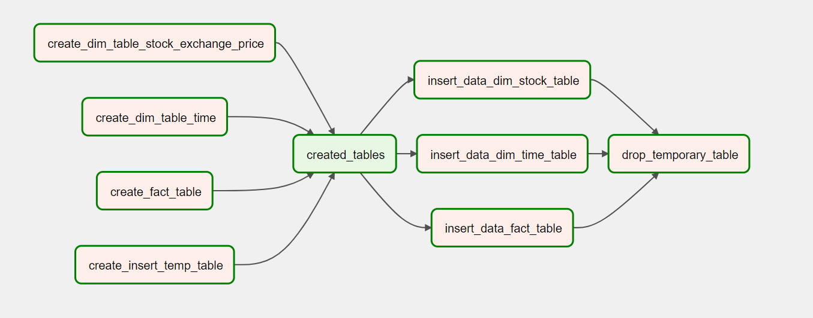

# GCP_Streaming-Crypto-ETL 

A streaming data pipeline for cryptocurrencies in a cloud environnement 

## Tools & Technologies 

| Category                  | Technology                          |
|---------------------------|-------------------------------------|
| Cloud                     | GCP                                 |
| Infrastructure as Code    | Terraform                           |
| Containerization          | Docker, Docker Compose              |
| Data Processing           | PySpark, Spark Streaming            |
| Orchestration             | Airflow                             |
| Data Lake                 | Google Cloud Storage                |
| Data Warehouse            | Big Query                           |
| Language                  | Python                              |
| Compute Environment       | Google Compute Engine VMs           |
| Cluster                   | Google Data Proc                    | 
| Event Streaming           | Kafka                               |

## Description 

This project aims to build a real-time ETL (Extract, Transform, Load) pipeline for cryptocurrency data using various cutting-edge technologies. The data is fetched from the Kucoin API, streamed through Kafka, processed using Spark Streaming on a DataProc cluster, and finally stored in BigQuery with a fact table, a time dimension table, and a stock dimension table. The entire process is orchestrated using Apache Airflow, and the infrastructure is managed using Terraform.

## Architecture

...

## DAG 

## Features

- Infrastructure as Code (IaC) management with Terraform
- Real-time data extraction from the Kucoin API
- Streaming data through Kafka for efficient processing
- Spark Streaming for real-time data processing on a DataProc cluster
- Storing processed data in BigQuery with a well-structured schema
- Orchestrating the ETL pipeline using Apache Airflow

## Data Flow 

- Real-time data collection through an API and sending it to a Kafka producer
- Data cleansing and normalization using Spark Streaming
- Data transfer to a Google Cloud Storage bucket
- Temporary table reads the recent data from Google Cloud Storage
- Creation of a fact table and two dimension tables based on the data in the temporary table

## Setup 

You must have a Google Cloud Platform (GCP) account with the command-line interface (CLI) set up, and you need to have Terraform installed

## Structure 

The project is organized into several folders specific to each major component.

- Infrastructure as code & GCP - [IaC](setup/terraform.md)
- Extract - [Extract](setup/extract.md)
- Stream - [Kafka](setup/Kafka.md)
- Stream Processing - [Spark](setup/spark_cluster.md)
- Orchestration - [Airflow](setup/airflow.md)

